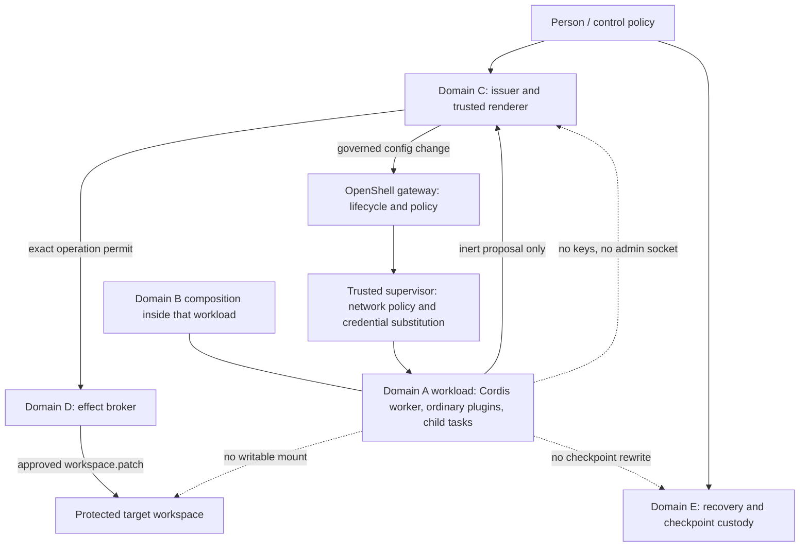

# Placement — Domains A–D and the OpenShell gateway

**Status: PROPOSED / UNRUN.** A diagram in this file confines nothing. OpenShell is not on the live path. No plugin, flag, crown path, or Approve step is added here. The proof harness is Docker only (`PROFILES.md`). The contracts that stay in AUKORA are `CORE-EXTRACT.md`.

## What is not enforced

The live app and a coding agent can still share a UID. Seatbelt confines BUILD (`workspace-write`) and read-only shells; Auma's sessions run danger-full-access, where Seatbelt is unenforced, until those sessions are actually started inside a qualified workload. An OpenShell gateway on a Mac is a local process with its own administrator. That administrator is inside the trust model (§20.6).

## Domains the spec keeps

From §4.2. Domain E is listed because recovery custody is part of the "outside the worker" rule in §1.5, even though the heading of this note is A–D.

| Domain | Responsibility | OpenShell role |
|---|---|---|
| A — proposal workers | Model adapters, ordinary tools, parsers, candidate code. No ambient owner credentials. | This is the confined **workload**. |
| B — composition host | Cordis lifecycle for replaceable parts. A shared process is not hostile-safe between plugins. | Ordinary plugins and owned child tasks run **inside the workload**. The host-facing bridge stays a narrow service, not a mount of the owner home. |
| C — authority service and trusted renderer | Trust anchors, approval material, scoped grants. Not writable by Domain A or ordinary Domain B. | **Outside** the workload. The gateway must not become this domain. |
| D — effect broker | Minimum access to the selected resource. Registered effect contracts only. | **Outside** the workload. The broker is not the supervisor and not a generic proxy. |
| E — evidence retention / recovery | Accounting and checkpoints outside the restore boundary they detect. | **Outside** the workload. Gateway logs are not this domain (§20.19). |

OpenShell's own supervisor and gateway are privileged dependencies. They are part of the trusted-base manifest. They are not Domain C and not Domain D (§4.5, §20.6).

## What stays outside the worker

| Resource | Protected owner | Workload posture (§20.9) |
|---|---|---|
| Issuer, Aumlok root, approval keys | Custody profile outside worker reach | Absent. Never a generic provider credential. |
| Trusted renderer and Aumlok popup | Host desktop, separate from the Linux workload | No raw signer socket, no `--forward` of `aumlok-signer.sock`. |
| Effect broker and the protected target workspace | AUKORA broker with preimage checks | No direct write, no broad mount. |
| Durable use/budget accounting | One owner: the AUKORA broker for the first `workspace.patch` path (§20.13) | No truncate, reset, or overwrite interface. |
| Recovery / checkpoint custody | Separately provisioned consumer | Not the gateway's log stream and not a second sandbox on the same host administrator. |
| GitHub push credential for the first profile | Separate promotion service | Absent from the worker. |
| Gateway, container-engine socket, policy files | Independently controlled deployment service | No admin credential and no management socket in the workload. |
| Local mnemonic story | Offline ceremony worker and trusted display | Never a remote-provider payload (§13.5, §11.5). |

The remote-model credential may be injected by the supervisor at the proxy. The worker process does not need the raw provider key. That injection is still a disclosure path for the request body (§11.5, §20.12).

## Diagram



Prose form of the same map (§20.8):

```text
PERSON
  | control policy / trusted review / explicit recovery
  v
AUKORA PROTECTED CONTROL DOMAIN  (Domains C, D, E)
  issuer, trusted renderer, use/revocation state, activation
  narrowly privileged workspace broker
  retained evidence / checkpoint consumer
  |                         |
  | governs allowed changes | executes approved workspace.patch
  v                         v
OpenShell gateway         protected target workspace
  |                         ^
  v                         | no writable worker mount
trusted supervisor ---------+---- permitted proposal service
  |
  v
CONFINED WORKLOAD  (Domain A, with Domain B composition inside it)
  read-only input snapshot, disposable scratch, candidate artifacts
  no owner home, no root keys, no gateway admin, no engine socket
```

The supervisor and the broker stay different roles even if a later profile colocates some infrastructure. Colocation changes the claim. It has to be stated in that profile.

## Two seams, both required

| Seam | Upstream piece | AUKORA piece that stays |
|---|---|---|
| Data plane | Supervisor, sandbox restrictions, inspected network policy, pre-credential middleware (gRPC `EvaluateHttpRequest` and the related methods in §20.11) | Admit `workspace.patch` only through the broker. Screen disclosures. Final check is deny-only and non-mutating. |
| Control plane | Gateway authentication and allowlisted pre-handler interceptors (§20.14) | A worker may propose a policy change. Only an independently admitted control operation may apply it. `post_commit` observes; it does not authorize. |

A loopback address, a container name, a claimed UID, or a caller-supplied `sandbox_id` does not authenticate the workload. OpenShell's trusted request context can be one input when the extension channel and its issuer are authenticated. AUKORA still binds that identity to the admitted activation, the run generation, and the granted holder (§20.9).

## Same-UID, stated as reachability

§20.7 replaces a single UID slogan with five questions. Placement answers them only when the mounts, inherited handles, environment, image, and bridge are the ones that were measured.

| Question | Placement this spec proposes | Still required |
|---|---|---|
| Can model-controlled code read the owner home, keys, or app state? | No mount, credential, or admitted connection from the workload to those paths. | Inspect the real mounts. Moving the main loop is not enough (T10). |
| Can a plugin skip a JavaScript guard? | The process boundary still applies. | No owner-privileged helper left beside it. |
| Can the worker call the signer? | Typed proposal endpoint only. | R2 acquisition, caller admission, scope, and trusted approval stay in Domain C (§7.7). |
| Can the worker rewrite policy, replay state, or a witness? | Those stores are outside its mounts, and the control plane is closed to it. | Separate the services whose compromise models differ. Checkpoints stay outside the restore domain. |
| Does this resist a compromised host administrator? | A VM driver can add a boundary. Hardware profiles are separate. | Name the trusted host, hypervisor, firmware, and administrator. No generic guarantee. |

The same numeric UID in an isolated guest and on the host is not the same authority. Two UIDs can still share a socket, a group permission, or a management API.

## Host route that already exists, and where the cage would sit beside it

These paths exist on the branch base `7a029c68b6f781071e623291a30f8888e91dd075`. The order below is the host route recorded in the PR #9 sketch and checked here only as file presence. It was not executed for this intake.

1. `plugins/aukora-action-gate/lib/self-change-tool.mjs`
2. `plugins/aukora-action-gate/lib/routes.mjs`
3. `plugins/aukora-seatbelt/lib/profile.mjs`
4. `scripts/aukora/self-change.mjs`
5. `apps/aukora-desktop/aumlok-signer.mjs`
6. `scripts/aukora/decide.mjs`
7. `scripts/aukora/aumlok-candidate-authority.mjs`
8. `scripts/aukora/become.mjs`

OpenShell, if it is ever qualified, sits beside steps 1–3 as the workload fence for proposal bytes. Steps 4–8 stay on the host, outside the worker. This document does not insert a call between them.

Laya stays STOP or ASK on that host route. The spec's §10 vocabulary (`NO_OBJECTION`, `REVIEW_REQUIRED`, `BLOCK`, `UNAVAILABLE`) is a proposed assessor contract. It still must not mint a grant. Registration on the trusted side does not give the model permission to edit backend policy (§10.6). Increment 4 is the first place the spec schedules Laya shadow evaluation (`INCREMENT-MAP.md`).

## Read next

- `SPEC-v0.2-INTAKE.md` — pins and section decisions
- `INCREMENT-MAP.md` — what a later build would have to earn
- `RESIDUAL-RISKS.md` — what this placement leaves open
