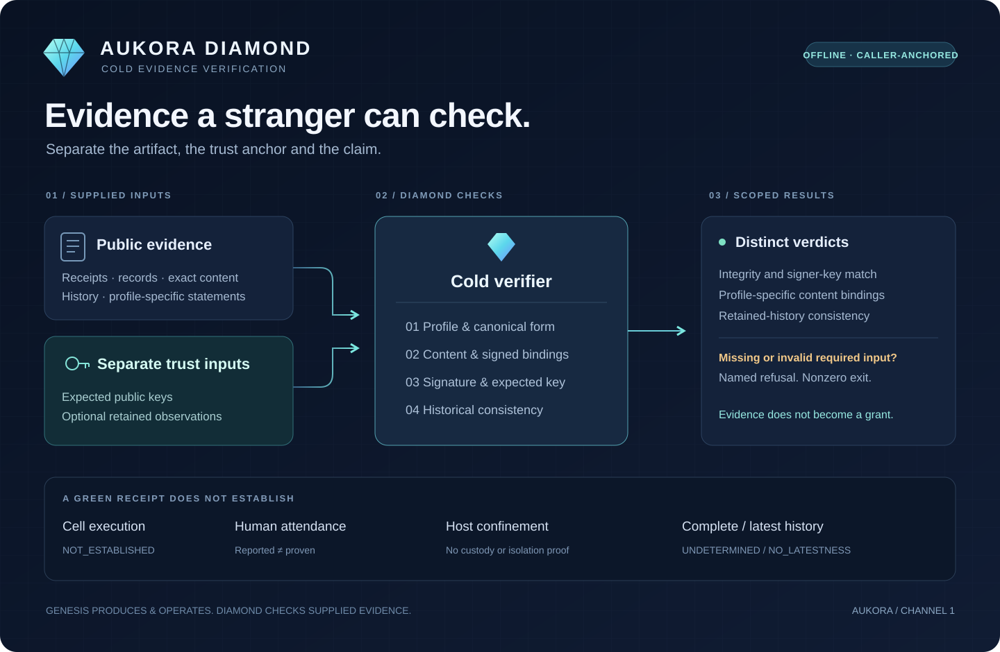

# AUKORA Diamond

**Offline verification of agent evidence, with explicit limits.**

[](https://github.com/aumara-xyz/aukora-diamond/actions/workflows/diamond.yml)
[](.github/workflows/diamond.yml)
[](LICENSE)

Diamond lets a recipient check supplied receipts, memory records and retained log
observations without running the agent that produced them. Trust anchors come from
the verifier's caller. Artifact contents do not appoint their own trusted signer.



**Evidence never authorizes.** A valid signature establishes a statement under a
key. It does not establish that a person attended, a WASM cell ran, a host was
confined, or the presented history is the latest or complete one.

## Start here

Use **Python 3.12**, Bash and Git. The cold consumers are implemented with the Python
standard library. Run the Alpha cold-profile checks without credentials, a sibling
checkout, a running agent, or network access during verification:

```bash
git clone https://github.com/aumara-xyz/aukora-diamond.git
cd aukora-diamond
python3 -B scripts/verify-cold-distillation.py
```

Success ends with `COLD DISTILLATION: PASS`. This executes the pinned Receipt v3
profile, source-budget check, runner controls, signed-freeze consumer and legacy
receipt/rotation/history tests. It reports which claims remain unestablished.
It is one part of the repository's acceptance suite, not a production certification.

To reproduce the broader reference demonstration and its final Diamond court:

```bash
python3 -m venv .venv
. .venv/bin/activate
python -m pip install 'pynacl>=1.5'
demo_dir=$(mktemp -d)
STRANGER_OUT="$demo_dir/a" STRANGER_OUT_B="$demo_dir/b" bash scripts/stranger-demo.sh
```

Dependency installation needs network access; the checks use disposable local
fixtures. The demo creates TEST keys and evidence under `demo_dir` and prints
`STRANGER-DEMO: GREEN` on success. Keep that directory private. The default command
without these variables recreates `out/` and `out-b/`.

## What you can verify

| Evidence profile | Entry point | What is checked |
| --- | --- | --- |
| Composition receipts: toy / Genesis siblings | [`scripts/cold-verify`](scripts/cold-verify) | Closed fields, signature and separately supplied signer anchor |
| Retained → presented observations | [`scripts/verify-pair`](scripts/verify-pair) | Anchored checkpoint signatures and Phase 0 consistency |
| Kira memory and approval artifacts | [`scripts/verify-kira-evidence.py`](scripts/verify-kira-evidence.py) | Record/content identity, signature, historical log position and supplied approval bindings |
| Alpha Receipt v3 | [`scripts/verify-alpha-profile.py`](scripts/verify-alpha-profile.py) | Frozen source pins and that profile's dedicated acceptance suite |
| Alpha legacy v1/v2 | [`scripts/verify-alpha-legacy.py`](scripts/verify-alpha-legacy.py) | Supplied receipt, effect bytes, key rotations, witness history and optional retained tips |
| Alpha freeze statements | [`scripts/verify-alpha-freeze.py`](scripts/verify-alpha-freeze.py) | Signed subject/tree statements under a caller-supplied key; not execution of the stated tests |

Profiles remain distinct. Diamond does not silently apply Receipt v3
canonicalization to Kira or reinterpret a receipt as a grant. See the
[verification guide](docs/VERIFICATION-GUIDE.md) for arguments and wire details,
and the [legacy profile guide](profiles/alpha/legacy/README.md) for a complete
public-fixture command.

## Where Diamond fits

**Genesis produces and operates. Diamond checks supplied evidence.** The cold
consumer paths do not load Deep's proposal cell, launch a Seatbelt guest, enroll
an identity, mint authorization or operate Electron.

The repository also preserves a **separate control-plane reference demo** under
`diamond/`: it creates test grants, performs toy load/unload transitions and emits
receipts. Those producer and signing helpers are outside the cold consumer's
permitted call paths. Their presence is documented, not presented as confinement.

The [continuity contract](CONTINUITY-SPINE.md) and its
[automated boundary checks](tests/continuity-spine/README.md) keep that distinction
visible. Static import policy is a regression check, not an OS sandbox.

## Review the evidence

- [Latest defensive review](docs/REVIEW-2026-09-22.md) — corrections and the executed local matrix.
- [Security model and forbidden claims](SECURITY.md) — the exact scope of a green verdict.
- [Measured limits](CEILINGS.md) — custody, attendance, runtime and durability limits.
- [Adversarial court inventory](REDTEAM.md) — checks and their negative controls.
- [Reviewer checklist](REVIEWER-CHECKLIST.md) — how to assess the evidence.
- [Alpha source inventory](SPEC-ALPHA-BYTES-MIGRATED.md) — copied bytes, adaptations and work still outside Diamond.
- [Genesis integration contract](docs/DISTILL-TO-GENESIS.md) — pass anchors separately and preserve the reported limits.
- [Documentation index](docs/README.md) — technical guides, fixtures and historical material.

CI runs the [committed acceptance workflow](.github/workflows/diamond.yml) on pull
requests and `main`, printing the exact tested commit before and after the checks.
It covers the Diamond court, stranger scenarios, Genesis receipts, Alpha profiles,
Kira approvals, composition contracts and isolated consumer checks. The badge links
to the actual run; it does not certify a separately deployed application.

## Contributing

Use focused changes with a reproducible command, an expected result and a negative
control for each changed verifier invariant. Keep source pins, public fixtures,
trust-anchor handling and profile boundaries explicit. Read
[CONTRIBUTING.md](CONTRIBUTING.md) before opening a pull request.

## License

Diamond-owned code is **GNU Affero General Public License v3.0 or later
(`AGPL-3.0-or-later`)**. See [LICENSE](LICENSE) and [NOTICE](NOTICE.md).

The AUKORA-owned Alpha copies are included under an
[explicit owner grant](profiles/alpha/NOTICE.md). Original proprietary notices
remain preserved as historical provenance; see [licensing scope](LICENSING.md).
Third-party notices remain applicable. Historical legal/design documents are
source material, not a product assurance.
